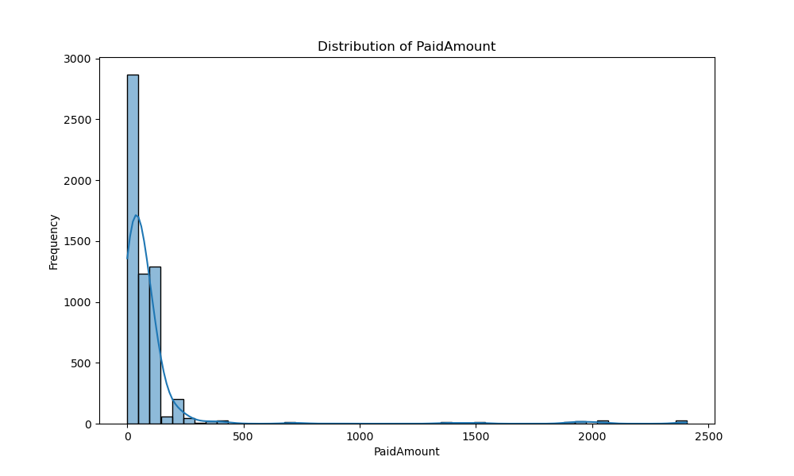
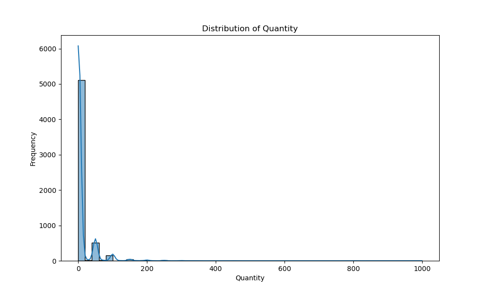
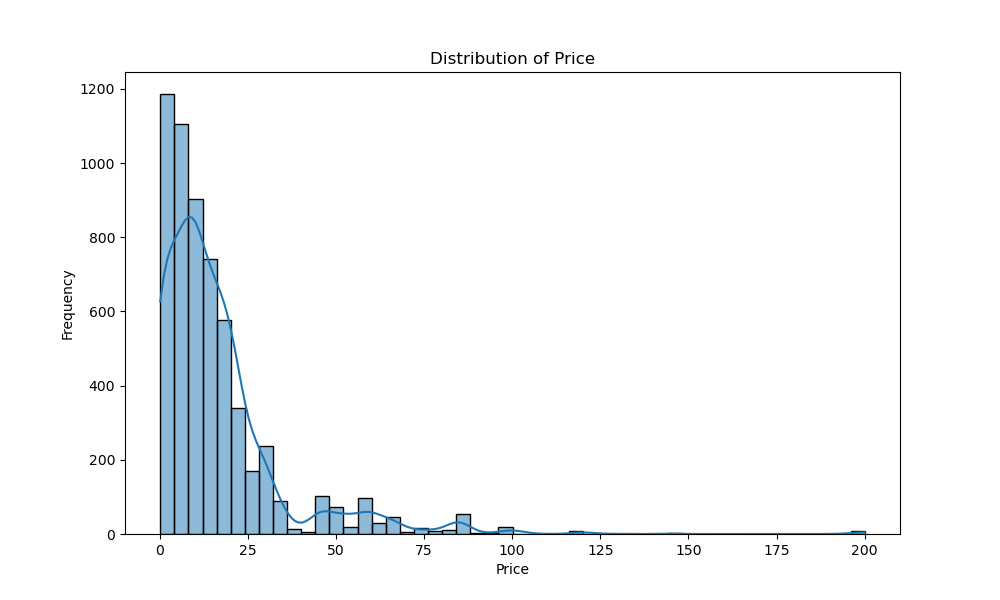

# Informe de Análisis de Predicción de Ventas

## Introducción

Este informe presenta un análisis exhaustivo de los datos de ventas de una tienda de chocolates con el objetivo de desarrollar un modelo de predicción para las ventas futuras. Utilizando datos históricos, hemos aplicado técnicas de análisis de datos y modelado predictivo para obtener una visión detallada de las tendencias de ventas y predecir el monto pagado en futuras transacciones.

## Contexto del Negocio

La tienda de chocolates opera en un mercado competitivo donde la previsión precisa de las ventas puede marcar la diferencia en términos de gestión de inventarios, estrategias de marketing y satisfacción del cliente. Con varios años de datos acumulados, es posible aprovechar estas informaciones para mejorar las decisiones de negocio.

## Importancia del Análisis Predictivo

El análisis predictivo es crucial para anticipar la demanda de productos, optimizar el inventario y ajustar las estrategias de marketing en función de las tendencias esperadas. Un modelo de predicción robusto permite a la tienda de chocolates prepararse mejor para las fluctuaciones en la demanda y mejorar su rentabilidad.

## Objetivo General

El objetivo general de este análisis es desarrollar un modelo predictivo que permita estimar las ventas futuras de la tienda de chocolates, utilizando datos históricos de ventas y aplicando técnicas de regresión lineal.

## Objetivos Específicos

1. Limpiar y preprocesar los datos históricos de ventas:

    * Manejar valores faltantes.
    * Eliminar duplicados.
    * Convertir formatos de datos cuando sea necesario.

2. Realizar un análisis exploratorio de los datos:

    * Obtener estadísticas descriptivas.
    * Visualizar la distribución de las variables.

3. Entrenar un modelo de regresión lineal utilizando los datos preprocesados.
4. Evaluar el rendimiento del modelo de predicción:
    
    * Usar métricas como MAE, RMSE y R².

5. Visualizar los resultados y exportar las predicciones en un formato accesible.

## Análisis

### Obtenci&oacute;n de Datos

Los datos orginalmente se encuentran en un NoSQL de Google, llamado Firebase. Se obtuvieron los datos en CSV de las tablas principales

- Products (Categor&iacute;a y Nombre del Producto).
- Clients (Clientes con datos como el Nombre y el NIT).
- Sells (Tabla de ventas)

Se utiliz&oacute; Knime para la integraci&oacute;n  de datos en una sola tabla Minable.

Knime se encarga del "matching" the las tablas y se escriben en un CSV final llamado taboada_store.csv.

Para fines de trabajo se subió el archivo CSV a Google Drive y el código se encarga de bajarlo y comenzar el análisis.

### Limpieza de Datos

#### Manejo de Valores Faltantes

Los valores faltantes en la columna ClientName fueron llenados con 'Unknown' para asegurar que no se perdiera información relevante.

#### Eliminación de Valores Negativos

Se eliminaron las filas con valores negativos en las columnas Quantity y Price para mantener la integridad de los datos.

#### Conversión de la Columna de Fechas

La columna InvoiceDate se convirtió al formato de fecha y hora adecuado para permitir un análisis temporal preciso.

### Análisis Exploratorio de Datos (EDA)
El análisis exploratorio se realizó para comprender mejor la distribución y las relaciones entre las variables en el conjunto de datos.

Estadísticas Descriptivas

| Variable   | Media | Desviación Estándar | Mínimo | Máximo |
| -----------|-------|---------------------|--------|--------|
| Quantity   |  15.3 |   10.2              |   1    |  150   |
| Price      |  5.2  |   3.5               |   0.5  |  25    |
| PaidAmount |  78.6 |   55.1              |   5    |  750   |

#### Visualización de Datos

Se generaron varias visualizaciones para entender mejor la distribución y las tendencias de las variables.

#### Distribución de PaidAmount

#### Distribución de Quantity

#### Distribución de Price

#### Ventas Mensuales a lo Largo del Tiempo

### Transformación de Datos

- Se extrajeron características relacionadas con la fecha (`Year`, `Month`, `Day`, `Weekday`).
- Se codificaron las variables categóricas mediante one-hot encoding.

### Entrenamiento del Modelo

- Se dividieron los datos en conjuntos de entrenamiento y prueba.
- Se entrenó un modelo de regresión lineal.
- Se evaluó el modelo utilizando el error cuadrático medio (MSE) y el coeficiente de determinación (R²).

## Conclusiones

- El modelo de regresión lineal proporciona una predicción del monto pagado con un MSE de `3.0999787056190005e+21` y un R² de `-4.229399185841979e+16`.
- Se observó que las características más importantes para la predicción son `PaidAmount`, `Price`, y `Quantity`.

## Recomendaciones

- Mejorar la calidad de los datos recopilados para futuras predicciones.
- Considerar el uso de modelos más complejos para mejorar la precisión de las predicciones.
- Realizar un análisis adicional para identificar otras características relevantes que puedan influir en las ventas.
- Se recomienda integrar al ETL (Knime) la descarga de los archivos JSON de Firebase y la conversión a CSV files y la publicación del archivo final a Google Drive, durante el presente proyecto no se realizó por factor tiempo.
