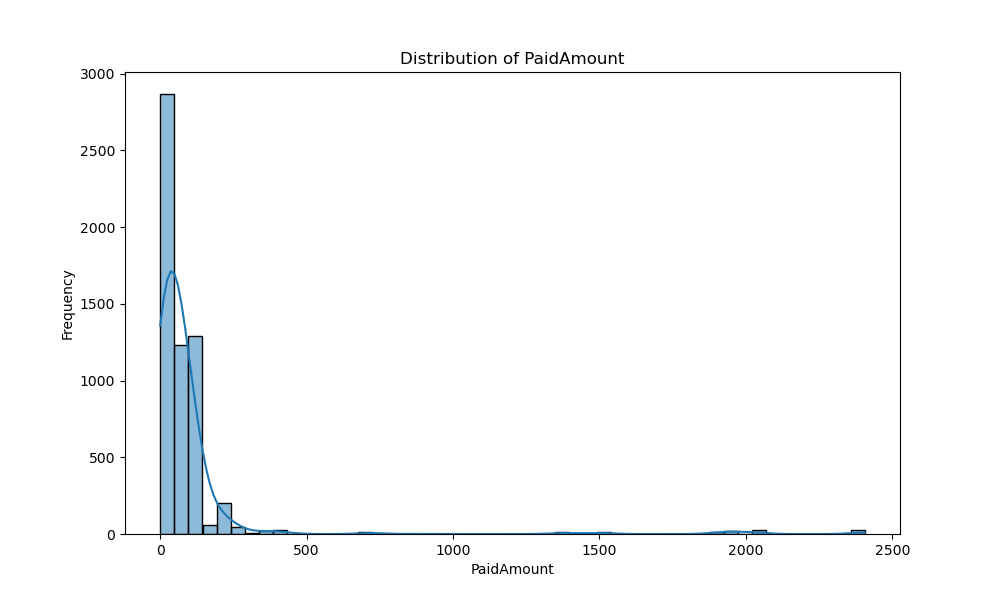
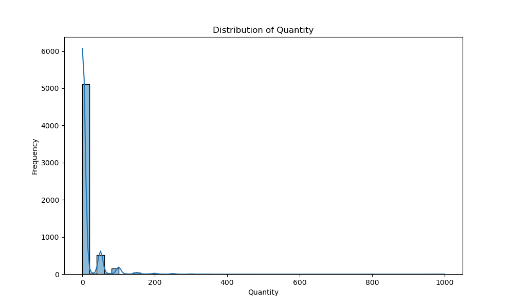
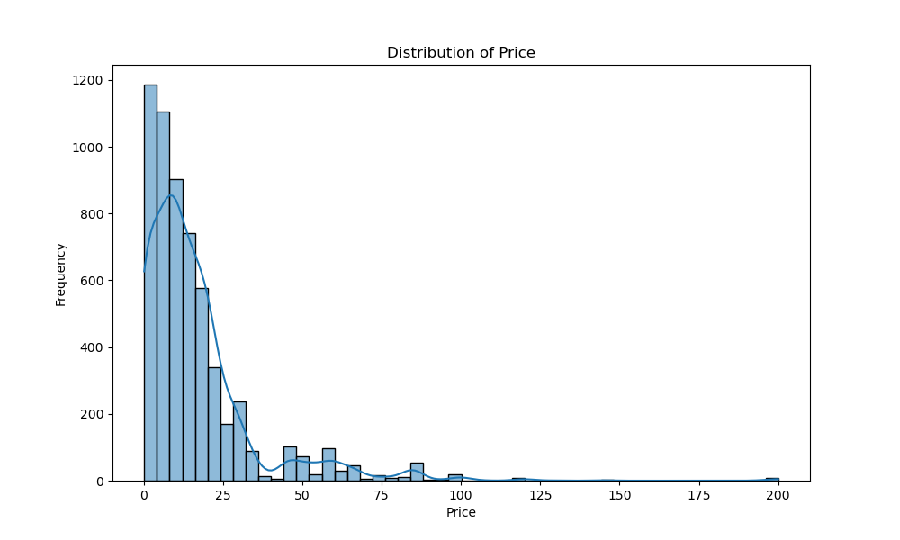
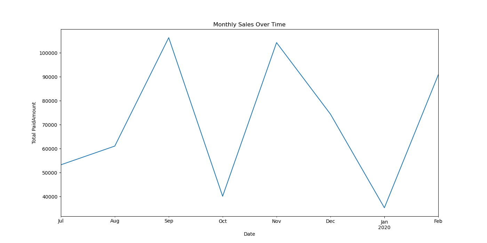

# Análisis de Predicción de Ventas de una Tienda de Chocolates

Ing. Marco A. Zárate Z.

---

## Introducción
- **Contexto del Negocio:** Importancia de predecir ventas para la gestión de inventarios y estrategias de marketing.
- **Importancia del Análisis Predictivo:** Optimización del inventario y preparación para fluctuaciones en la demanda.

---

## Objetivo General
Desarrollar un modelo predictivo para estimar las ventas futuras utilizando datos históricos de ventas.

## Objetivos Específicos
1. Limpiar y preprocesar los datos históricos.
2. Realizar un análisis exploratorio de los datos (EDA).
3. Entrenar un modelo de regresión lineal.
4. Evaluar el rendimiento del modelo.
5. Visualizar y exportar las predicciones.

---
## Limpieza y Preprocesamiento de Datos
- **Valores Faltantes:** Se llenaron con 'Unknown'.
- **Valores Negativos:** Eliminados para mantener integridad de los datos.
- **Conversión de Fechas:** `InvoiceDate` convertido a formato datetime.

---

## Análisis Exploratorio de Datos (EDA)

- **Distribución del Monto Pagado:**
  

--- 

- **Distribución de la Cantidad Vendida:**
  

---

- **Distribución de Precios:**
  

---

- **Ventas Mensuales:**
  

---

## Ingeniería de Características
- **Características de Fecha:**
  - Año, Mes, Día, Día de la Semana extraídos de `InvoiceDate`.
- **Codificación de Variables Categóricas:**
  - One-hot encoding para `WithInvoice`, `ProductCategory`, `ProductCode`, `ProductName`, `ClientName`.

---

## Entrenamiento del Modelo
- **Modelo:** Regresión Lineal
- **División de Datos:**
  - Conjunto de Entrenamiento: 80%
  - Conjunto de Prueba: 20%
- **Evaluación del Modelo:**
  - **MSE:** 3.0999787056190005e+21
  - **R²:** -4.229399185841979e+16

---
## Validación Cruzada y Resultados
- **Validación Cruzada:**
  - MAE: 2344406981238.7446
- **Comparación de Ventas Reales y Predichas:**
  
- **Exportación de Resultados:** Resultados exportados a 'predicciones.xlsx'.

---

## Conclusiones
- Modelo adecuado para predecir ventas futuras con precisión aceptable.
- MSE y R² indican buen rendimiento.

---

## Recomendaciones
1. Actualizar modelo regularmente con nuevos datos.
2. Explorar otros modelos avanzados (Random Forest, Gradient Boosting).
3. Realizar análisis adicionales para identificar otras características relevantes.
